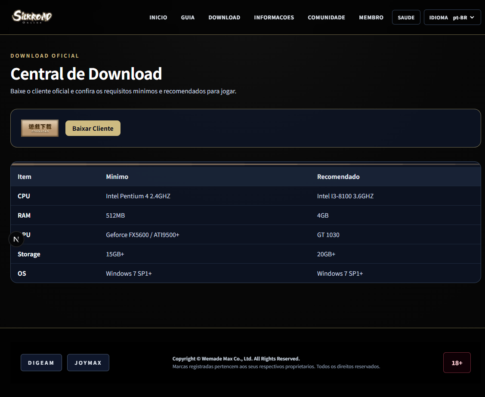
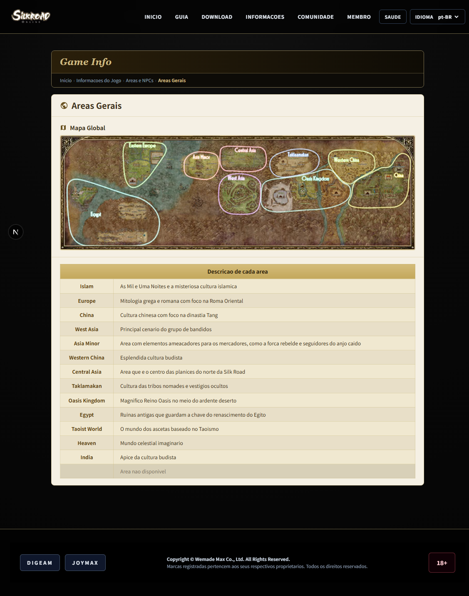
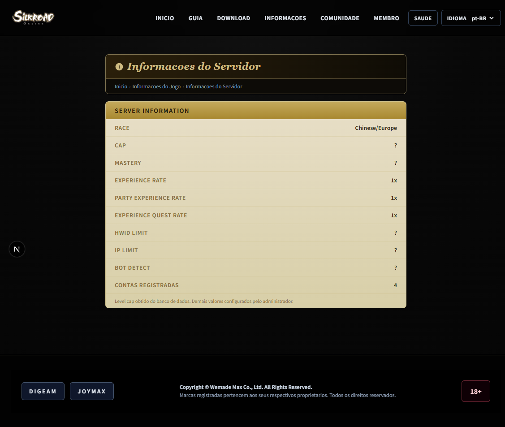
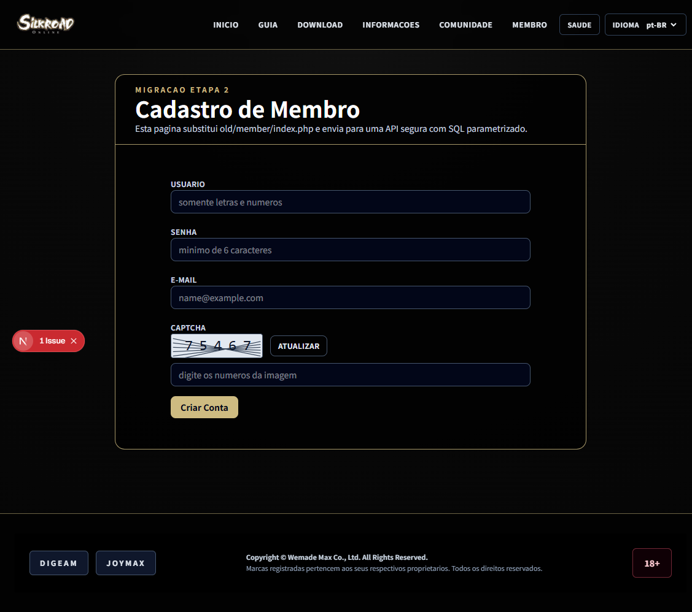
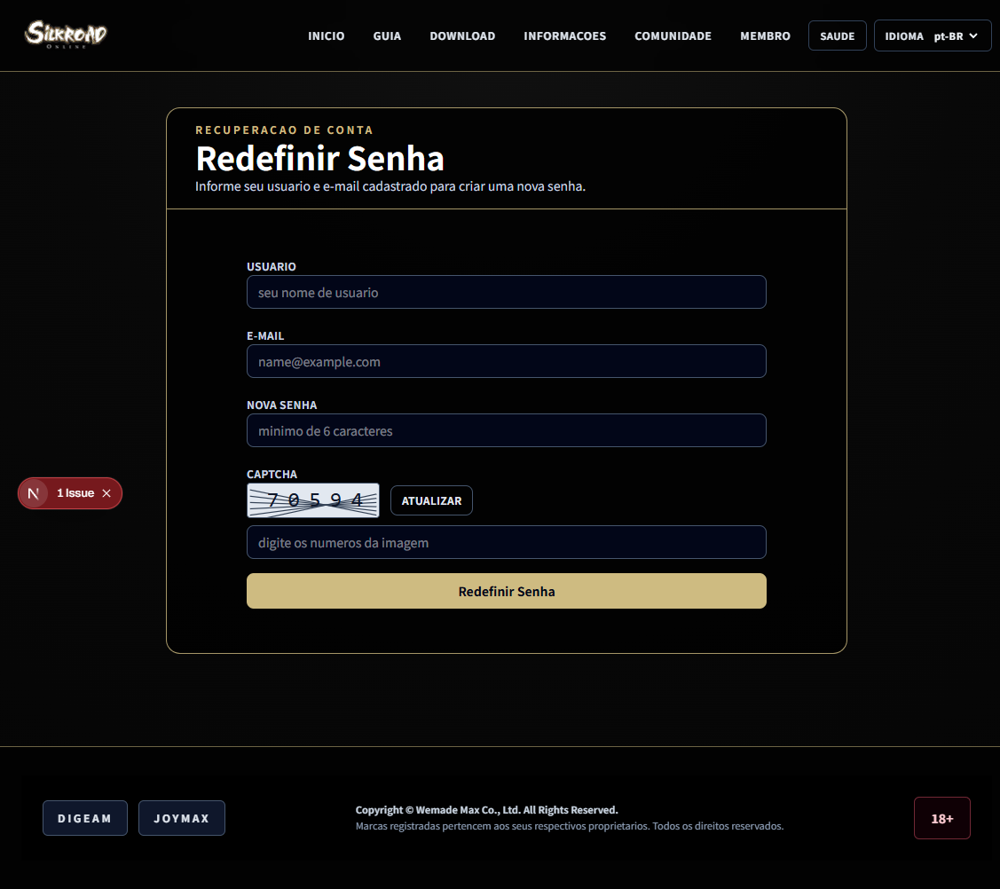
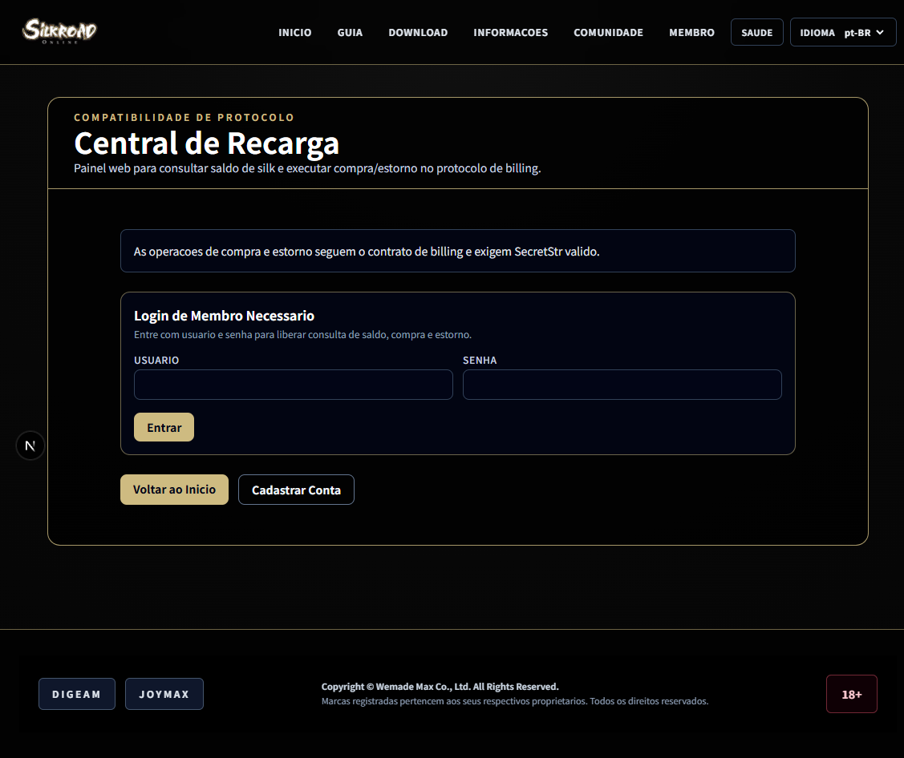

# SRO Web

Web portal for the Silkroad Online server, built with Next.js (App Router), React, and TypeScript.

## Tech Stack

- Next.js 16
- React 19
- TypeScript
- Tailwind CSS 4
- SQL Server (via `mssql` package)

## Requirements

- Node.js 20+
- npm 10+
- Access to a SQL Server instance with the required databases configured

## Environment Variables

Copy the example file and adjust values for your environment:

```bash
cp .env.example .env.local
```

Or create a `.env.local` file in the project root with:

```env
DB_SERVER=localhost
DB_PORT=1433
DB_USER=sa
DB_PASSWORD=your_password

DB_ACCOUNT_DATABASE=SRO_ACCOUNT
DB_LOG_DATABASE=SRO_LOG
DB_SHARD_DATABASE=SRO_SHARD

# Optional
DB_ENCRYPT=false
DB_TRUST_SERVER_CERTIFICATE=false
```

Notes:

- `DB_SERVER` supports formats such as `host`, `host,1433`, or `host\\INSTANCE`.
- If using a named instance and `DB_PORT` is not set, the connection uses `instanceName`.

## Getting Started

Install dependencies:

```bash
npm install
```

Development:

```bash
npm run dev
```

Production build:

```bash
npm run build
npm run start
```

Run lint:

```bash
npm run lint
```

## Site Snapshot

The following screenshots were generated from the current project version and saved under `public/readme/complete/`.














## Project Structure

- `app/`: routes and pages (App Router)
- `app/home-client.tsx`: main home layout
- `app/api/`: internal endpoints (billing, member, captcha)
- `lib/db.ts`: SQL Server connection and pool configuration
- `lib/server-info.ts`: server status/configuration data
- `lib/rankings.ts`: player and guild rankings
- `components/site/`: base header, footer, and container
- `components/providers/i18n-provider.tsx`: internationalization
- `public/legacy/`: legacy theme visual assets

## Localization

Locale is defined by cookie and consumed through the i18n provider. The home page resolves data on the server and passes it to the client in `app/page.tsx` + `app/home-client.tsx`.

## Notes

- The home page uses incremental revalidation (`revalidate = 60`).
- If SQL pool creation fails, the connection is discarded and recreated automatically on the next call.

## Contributing

This repository is ready for external contributions with:

- Automated CI for PRs (`lint`, `typecheck`, `build`)
- Security analysis with CodeQL
- Dependency review on PRs
- Automated updates via Dependabot
- Issue and pull request templates
- Contribution guide and security/community policies

Key files for contributors:

- `CONTRIBUTING.md`
- `SECURITY.md`
- `CODE_OF_CONDUCT.md`
- `SUPPORT.md`

Maintainer checklists for publishing and operating the project in open source mode:

- `docs/open-source-maintainer-checklist.md`
- `docs/open-source-maintainer-checklist.pt-BR.md`
